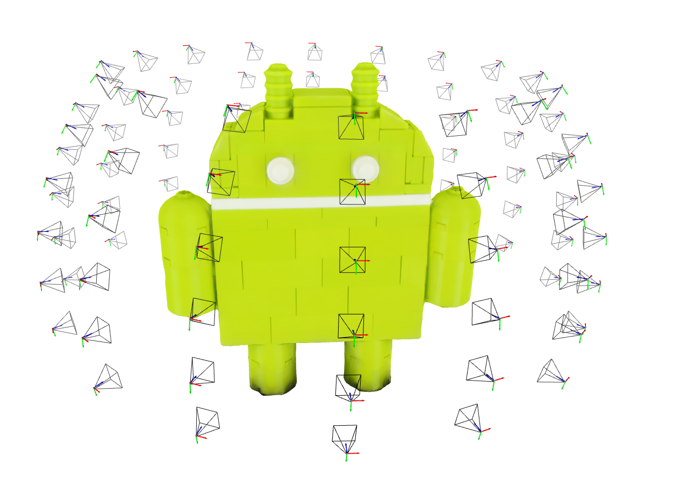

# README

## Overview

This script is designed for visualizing 3D models using Open3D, a modern library for 3D data processing. The script loads a 3D model (in OBJ format) and a set of camera parameters (from a JSON file), and then visualizes the model along with camera positions in a 3D space. It also includes the option to visualize coordinate axes at each camera position.

## Requirements

- Python 3.x
- Open3D library
- NumPy library

## Installation

Before running the script, you need to install the Open3D and NumPy libraries. You can install them using pip:

```
pip install open3d numpy
```

## Usage

The script is executed from the command line and takes three optional arguments:

1. `--model_path`: Path to the OBJ file of the 3D model. Default is `"model.obj"`.
2. `--camera_path`: Path to the JSON file containing camera parameters. Default is `"meta.json"`.
3. `--add_axis`: A boolean flag to decide whether to add coordinate axes at each camera position. Default is `False`.

### Command Line Syntax

```
python <script_name>.py [--model_path PATH_TO_MODEL] [--camera_path PATH_TO_CAMERA_PARAMETERS] [--add_axis BOOLEAN]
```

### Example

|Without coordinate axes|With coordinate axes|
|:---------------------:|:------------------:|
|||


## Note

- Ensure that the paths to the model and camera parameter files are correct.
- The script uses a simple logarithmic function to adjust color intensity based on distance, which can be modified as per specific requirements.
- The `view_point` for distance calculation is currently set to `[0, -2, 0]` in the script and can be adjusted as needed.

